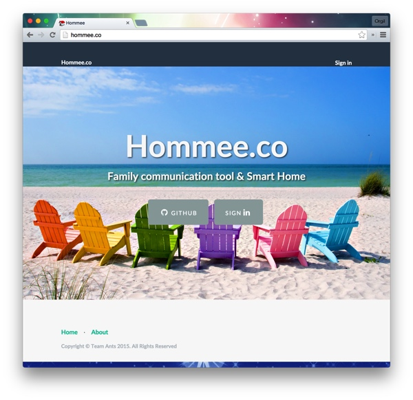
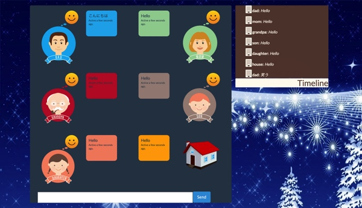
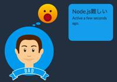
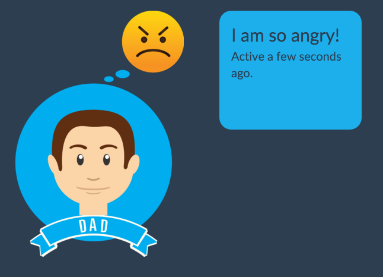
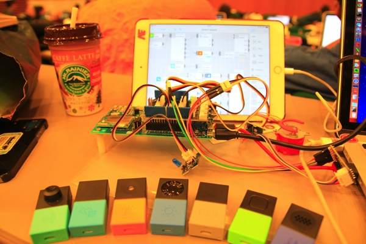

# Hommee.co
Try me [http://hommee.co/](http://hommee.co/)
## 製品概要

家族の絆を深める、家族内チャットツール。家族メンバーの感情分析などによって家族間コミュニケーションを促進させる。

また、IoT化された家(スマートホーム)が家族のメンバーとして家族のことを暖かく見守る。

### 背景(製品開発のきっかけ、課題等)
現代社会問題の一つはやはり家族のあり方である。日々変わる現代社会では家族内の絆が弱まっており、家族内のコミュニケーションが減りつつある。

そして情報化する世の中、IoT化されたスマートホームが温かみを持つことは大事である。チャットツール内でまるで家族メンバーの一人のようにぬくもりをもって家が接してくれることを理想とする。
### 製品説明（具体的な製品の説明）
家族内チャットツール。お父さん、お母さん、おじいちゃん、おばあちゃん、兄妹のみんなが一つのチャットルームにいる。それぞれの何気ないチャットを感情アナライズエンジンによって"嬉しさ"、"悲しさ"、"恐怖"、"怒り"などの感情をチャット内で可視化する。可視化された感情によって時には**笑い**が生まれ、時には家族な**大事な問題解決**に繋がるだろう。

またMESHやIntel EdisonによってIoT化された家のアバターもチャット内におり、温度や湿度などのモニタリングができたり、家に話しかけることで電気を消したり、家に帰った時には家がお帰りなさいと暖かく迎えてくれる。AIを持った家が家族メンバーのひとりとして具現化する。
### 特長

####1. 特長1
anger, fear, sadness, happy, neutralなどの感情分析、可視化

####2. 特長2
MESHやEdisonによって、スマート化された家。温度、湿度、人感センサーなどのデータをモニタリング。
####3. 特長3
チャットもしくはAIが自動的にうちのライトや家電を制御。(実装ではMESHやEdisonでLチカ)

### 解決出来ること
家族内の交流を深める。
家を家族メンバーのひとりとして迎える。
### 今後の展望
感情分析強化

センサーデータや感情などの値からアクションを起こすパターン追加
### 注力したこと（こだわり等）
* 感情分析 多言語(英語、日本語)
* UI / UX
* MESH, Edisonの制御

## 開発技術
### 活用した技術

#### API・データ
* Python nltk 自然言語処理ライブラリ
* Openweather 天気予報

#### フレームワーク・ライブラリ・モジュール
* Webアプリ
    * Python Flask Framework
    * SocketIO
    * nlp 自然言語処理ライブラリ
* ハードウェア
    * MESH SDK
    * Node.js (Edison)

#### デバイス
* MESH
    * 温湿度計
    * 人感センサー
    * モーションセンサー
* Edison
    * 温度センサー
    * LED、サーボモータ出力

### 独自技術
#### ハッカソンで開発した独自機能・技術
* 感情分析、可視化
* MESHとEdisonとサーバの3者のつなぎ込み

#### 製品に取り入れた研究内容（データ・ソフトウェアなど）（※アカデミック部門の場合のみ提出必須）
* 最新の自然言語処理技術 単語の感情分析データ(英語、日本語)

### 実際に使ってみるには、
####以下のメールアドレスから一つ選んで、hommeeというパスワードでログインしください。 
* mom@gmail.com  
* dad@gmail.com  
* grandpa@gmail.com  
* son@gmail.com  
* daughter@gmail.com  

